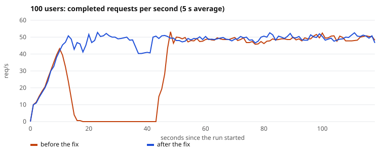
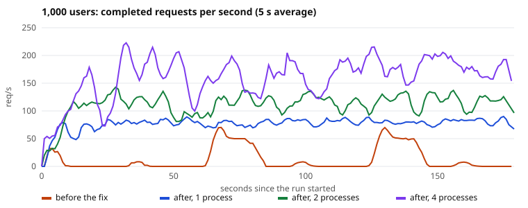

# Phase 17 — Load Test Results

Generated by `scripts/render_loadtest.py` from the files in `benchmarks/phase17/raw/`, so every number below is the one the harness recorded. The one exception is the *before* half of the burst table in §1, transcribed from console output: it was measured against builds that no longer exist.

## Setup

- **Machine:** one laptop — AMD Ryzen 5 5600H, 6 cores / 12 threads. Docker Desktop's VM gets 12 vCPUs and 3.5 GB. Locust runs on the same machine, so the load generator and the system under test compete for the same cores. These are this laptop's numbers, not a capacity figure for the design.
- **Stack:** the Phase 13/15 Compose stack as committed — one Uvicorn process, SQLAlchemy's default pool of 5 + 10 connections, one worker.
- **Data:** the Phase 14 dataset. Reads go to the 20 `bench-NN@taskflow.local` accounts, which own ~200K rows between them (~10,061 each). Submissions go to 50 dedicated `loadtest-NN@taskflow.local` accounts, so the Phase 14 dataset isn't modified.
- **Auth:** access tokens minted at test start with the app's own `create_access_token` — the same claims `/auth/login` issues. They can't come from `/auth/login`: it allows 10 requests/min per IP, and `*@taskflow.local` can't log in over HTTP at all (`.local` is a special-use domain and `EmailStr` rejects it with a 422). **Login latency is not measured.**
- **Mix:** each simulated user waits 1–3 s between requests. Of its requests, 10 : 5 : 3 : 1 are list page 1, list filtered by status, fetch one job, submit a job.
- **Client:** Locust 2.46 `FastHttpUser`, one process, against `http://127.0.0.1:8000`. It never logged its high-CPU warning.
- **Server side, sampled during every run:** `docker stats` CPU per container, `pg_stat_activity` connection states, `jobs` queue depth, and a separate process calling `GET /health` every 100 ms. After each run: queue delay for every submitted job, and the API's own log.
- Percentiles are Locust's, which rounds anything over 100 ms to two significant figures.

## Summary

| Run | Build | Users | Requests | Failed | Server 5xx | req/s | p50 | p95 | p99 | API CPU | Postgres CPU |
|---|---|---|---|---|---|---|---|---|---|---|---|
| `before_u10` | before fix | 10 | 576 | 0 (0.0%) | 0 | 4.9 | 15 ms | 33 ms | 82 ms | 10% | 3% |
| `before_u100` | before fix | 100 | 4,021 | 40 (1.0%) | 40 | 34.1 | 27 ms | 210 ms | 31 s | 63% | 19% |
| `before_u1000` | before fix | 1,000 | 2,176 | 2,036 (93.6%) | 43 | 13.5 | 60 s | 60 s | 60 s | 1% | 0% |
| `u10` | after fix | 10 | 569 | 0 (0.0%) | 0 | 4.9 | 15 ms | 41 ms | 670 ms | 10% | 3% |
| `u100` | after fix | 100 | 5,564 | 0 (0.0%) | 0 | 47.2 | 25 ms | 150 ms | 340 ms | 67% | 20% |
| `u1000` | after fix | 1,000 | 13,841 | 0 (0.0%) | 0 | 77.4 | 10 s | 11 s | 12 s | 144% | 73% |
| `exp_workers4_u1000` | after fix, 4 Uvicorn processes (experiment) | 1,000 | 28,799 | 0 (0.0%) | 0 | 161.4 | 3.6 s | 6.1 s | 7.7 s | 418% | 184% |

req/s is over the whole run, including ramp-up. CPU is the median over the steady state (10 s after the last user spawned, to the end); 100% is one core.

## 1. At 100 users the API deadlocked

The first 100-user run failed 40 requests with HTTP 500, all `QueuePool limit of size 5 overflow 10 reached, connection timed out, timeout 30.00` — at 34 req/s, when ~25 ms requests need about one connection on average, not fifteen. The server-side samples show it wasn't load:

- From t≈12s to t≈41s the API process sat at **0.2% CPU**, and every one of its 15 connections was `idle in transaction` — checked out, running nothing.
- The `/health` probe went **31 s without an answer**: 1 request hit its 30 s client timeout, and the next one waited for the freeze to end.
- It ended 30 s after it began — `pool_timeout` — and exactly **40** requests failed: the size of anyio's threadpool.

**Mechanism.** FastAPI runs each sync dependency, the sync endpoint, and response validation as *separate* trips into one shared threadpool of 40 threads. A request's Session checks out its connection in `get_current_user` and keeps it until the request ends — across those trips. When more than 15 + 40 requests are in flight, every connection can end up held by a request waiting for a thread, and every thread by a request waiting for a connection. Nothing moves until the 40 threads' pool checkouts time out. (FastAPI's own source names this hazard for a dependency's teardown and works around it there — only there.)

**Reproduced on demand** with `loadtest/burst.py` — n simultaneous `GET /jobs`:

| Build | n | Outcome | p50 | max | Peak `idle in transaction` |
|---|---|---|---|---|---|
| container, pool 15, no cap | 40 | 40× 200 | 353 ms | 473 ms | — |
| container, pool 15, no cap | 50 | 50× 200 | 309 ms | 474 ms | — |
| container, pool 15, no cap | 60 | 20× 200, 40× 500 | 31 s | 31 s | — |
| container, pool 15, no cap | 100 | 60× 200, 40× 500 | 33 s | 33 s | 15 |
| host API, pool 40, no cap | 60 | 60× 200 | 1.2 s | 1.3 s | 34 |
| host API, pool 40, no cap | 100 | 60× 200, 40× 500 | 32 s | 32 s | 40 |
| host API, pool 15, with cap | 100 | 100× 200 | 621 ms | 854 ms | 12 |
| host API, pool 15, with cap | 200 | 200× 200 | 1.2 s | 2.0 s | 15 |
| container, pool 15, **with cap** (final) | 60 | 60× 200 | 1.7 s | 2.0 s | 15 |
| container, pool 15, **with cap** (final) | 100 | 100× 200 | 595 ms | 1.0 s | 8 |
| container, pool 15, **with cap** (final) | 200 | 200× 200 | 1.3 s | 2.3 s | 10 |

The threshold sits between 50 and 60, as 15 + 40 = 55 predicts. **Raising the pool doesn't fix it — it moves the threshold** to pool + 40: at 40 connections, 60 passes and 100 wedges identically, with 40 × 500 and all 40 connections idle in transaction.

**Fix:** `app/concurrency_limit.py` caps in-flight requests per process at the pool size (`db_pool_size + db_max_overflow`, now explicit settings). At most 15 requests hold or want a connection, so a checkout never waits, and they never need more than 15 of the 40 threads — the cycle can't form. Requests over the cap wait in the event loop holding nothing. It depends on each request using exactly one Session, which `get_db` guarantees. Verified that the Session closes before the cap's slot is released, on success and error paths. `tests/integration/test_concurrency_limit.py` fires 100 simultaneous requests; with the cap removed it fails — pool `TimeoutError`s, slowest request 61 s — and with it it passes in ~3 s.

## 2. Per endpoint, after the fix

**10 users**

| Endpoint | Requests | req/s | p50 | p95 | p99 | max |
|---|---|---|---|---|---|---|
| `/jobs [list]` | 296 | 2.5 | 15 ms | 39 ms | 1.0 s | 1.9 s |
| `/jobs [filtered]` | 150 | 1.3 | 15 ms | 34 ms | 87 ms | 1.9 s |
| `/jobs/{id}` | 95 | 0.8 | 14 ms | 41 ms | 490 ms | 487 ms |
| `/jobs [submit]` | 28 | 0.2 | 27 ms | 70 ms | 300 ms | 303 ms |

**100 users**

| Endpoint | Requests | req/s | p50 | p95 | p99 | max |
|---|---|---|---|---|---|---|
| `/jobs [list]` | 2,914 | 24.7 | 25 ms | 160 ms | 360 ms | 911 ms |
| `/jobs [filtered]` | 1,498 | 12.7 | 25 ms | 150 ms | 340 ms | 926 ms |
| `/jobs/{id}` | 861 | 7.3 | 22 ms | 120 ms | 310 ms | 940 ms |
| `/jobs [submit]` | 291 | 2.5 | 38 ms | 210 ms | 560 ms | 797 ms |

**1,000 users**

| Endpoint | Requests | req/s | p50 | p95 | p99 | max |
|---|---|---|---|---|---|---|
| `/jobs [list]` | 7,554 | 42.2 | 10 s | 11 s | 12 s | 12 s |
| `/jobs [filtered]` | 3,635 | 20.3 | 10 s | 11 s | 12 s | 12 s |
| `/jobs/{id}` | 1,945 | 10.9 | 11 s | 11 s | 12 s | 12 s |
| `/jobs [submit]` | 707 | 4.0 | 11 s | 11 s | 12 s | 12 s |

At 10 users the p99 is set by a handful of slow requests out of ~569. The `/health` probe saw the same moment (one response of 1.9 s), so it was on the server, not in Locust. Its cause is **unexplained**. It overlapped a Postgres checkpoint that fsynced ~1,700 files, but forcing one that fsynced ~1,100 files over 1.7 s while probing left `/health` under 10 ms, so that hypothesis is refuted.

## 3. At 1,000 users the ceiling is one Python process

Before the fix, 1,000 users took the API down: 93.6% of requests failed, most at Locust's 60 s client timeout, at 13 req/s. It was wedged in 91 of 95 samples, at a median 1.4% API CPU.

After the fix: **zero failures, 77 req/s** — but a p50 of 10 s. That latency is queueing, not slowness: 1,000 users that each wait ~2 s between requests, at a p50 of 10 s, can only generate about 1000 ÷ (10 + 2) ≈ 83 req/s — close to the 77 measured. Something saturated. The steady-state samples say what:

| | Median | p90 |
|---|---|---|
| API CPU | 144% | 161% |
| Postgres CPU | 73% | 94% |
| Worker CPU | 5% | 9% |
| Redis CPU | 1% | 11% |
| Postgres connections running a query | 0 | 1 |
| Connections checked out, between queries | 8 | 12 |
| `jobs` queue depth | 0 | 0 |

The API runs at roughly one core of Python bytecode plus the work that runs outside the GIL. Postgres is mostly idle and is almost never *running* a query when sampled. The worker, Redis and the queue are nowhere near busy.

**Tested, not assumed:** the same image with 4 Uvicorn processes (`WEB_CONCURRENCY=4`, an experiment, not committed):

| Uvicorn processes | req/s | p50 | p95 | Failed | API CPU | Postgres CPU | API CPU per request |
|---|---|---|---|---|---|---|---|
| 1 | 77 | 10 s | 11 s | 0 | 144% | 73% | ~19 ms |
| 4 | 161 | 3.6 s | 6.1 s | 0 | 418% | 184% | ~26 ms |

Throughput rose 2.1× — so the single process was the ceiling. Not 4×, because CPU per request grew too. With 6 physical cores shared by four API processes, Postgres, Locust and Windows, that's consistent with work landing on busy hyperthreads. Past this point the numbers describe the laptop, not the design, so this was the last experiment.

### Where the CPU goes

`py-spy record --gil` against the API container under 1,000 users: 3,139 samples of whichever thread held the GIL, attributed to the innermost library on the stack:

| Share | Library |
|---|---|
| 40.8% | SQLAlchemy (statement caching, compiling, building result rows) |
| 15.3% | FastAPI (routing, dependency solving, threadpool dispatch) |
| 13.7% | anyio (handing work to and from the threadpool) |
| 9.1% | asyncio event loop |
| 5.2% | uvicorn (HTTP protocol) |
| 4.5% | pydantic (validation, serialization) |
| 4.4% | Starlette |
| 2.5% | logging (access log) |
| 1.4% | psycopg2 (the Postgres driver) |
| 1.1% | TaskFlow's own code |

Inclusive costs worth naming:

| Share | |
|---|---|
| 13.7% | `list_jobs`: the page query and turning its rows into objects |
| 9.6% | `list_jobs`: the `COUNT(*)` for the page total |
| 9.5% | `get_current_user`: loading the user row |

The same request costs Postgres **2.3 ms** — EXPLAIN ANALYZE, median of 5, for a user with 10,061 jobs:

| Statement | Execution | Plan |
|---|---|---|
| user lookup (get_current_user) | 0.043 ms | Seq Scan |
| COUNT(*) for the page total | 2.236 ms | Index Only Scan [uq_jobs_user_idempotency_key] |
| page of 20 (Phase 14b index) | 0.061 ms | Index Scan [idx_jobs_user_created] |

So **Phase 14b's index holds under concurrency**: the page query is 0.061 ms, and the database is not what limits this API: at 1,000 users, the median number of connections running a query at any sampled moment is 0. What costs time is the Python around each query — SQLAlchemy's per-statement machinery and FastAPI's dispatch — paid three times per list request. The `COUNT(*)` is now the most expensive SQL, at 96% of the request's database time, because it reads every one of the user's rows.

## 4. Queue delay

From the API accepting a job to the worker starting it (`started_at - created_at`), for every job each run submitted. Locust can't see this — its clock stops at the 201.

| Run | Jobs | Succeeded | Queue delay p50 | p95 | max | Accepted → done p50 |
|---|---|---|---|---|---|---|
| `before_u10` | 25 | 25 | 20 ms | 31 ms | 191 ms | 36 ms |
| `before_u100` | 211 | 211 | 24 ms | 162 ms | 31 s | 38 ms |
| `before_u1000` | 7 | 7 | 864 ms | 1.4 s | 1.4 s | 890 ms |
| `u10` | 28 | 28 | 19 ms | 51 ms | 355 ms | 33 ms |
| `u100` | 291 | 291 | 26 ms | 115 ms | 288 ms | 40 ms |
| `u1000` | 709 | 709 | 125 ms | 207 ms | 1.6 s | 140 ms |
| `exp_workers4_u1000` | 1567 | 1567 | 236 ms | 635 ms | 3.2 s | 259 ms |

The single worker kept up at every load level: 0 jobs were left pending across all runs, the deepest the `jobs` queue got in any sample was 23, and in every run the last job finished at most 0.58 s after the last one was submitted. The 31 s maximum in `before_u100` is the deadlock, not the worker: a job committed just before the freeze couldn't be published until it ended.

## 5. Not measured, and caveats

- **Login.** Not in the mix — see Setup.
- **One machine.** Locust shares the CPU with the server. Nothing here should be read as what the design does on dedicated hardware.
- **The cap moves waiting, it doesn't remove it.** Past saturation, requests queue in the event loop instead of deadlocking. That includes `/health`: it waited ~10 s at 1,000 users, longer than the Compose healthcheck's 5 s timeout, so the API reports `unhealthy` while saturated. Compose only reports that. An orchestrator that *restarts* on a failed liveness check would restart a working, saturated API, making things worse, so liveness there would need an endpoint that bypasses the cap and the database.
- **No load shedding.** A queue that only grows is not a strategy for sustained overload. A bound on waiting requests, answered with 503, would be the next step.
- **Levers not pulled**, in rough order of effort: more Uvicorn processes (measured above; each needs its own 15 connections against Postgres's 100); dropping the per-page `COUNT(*)`; fewer ORM round trips per request; async endpoints, which avoid threadpool trips altogether and are the largest change.
